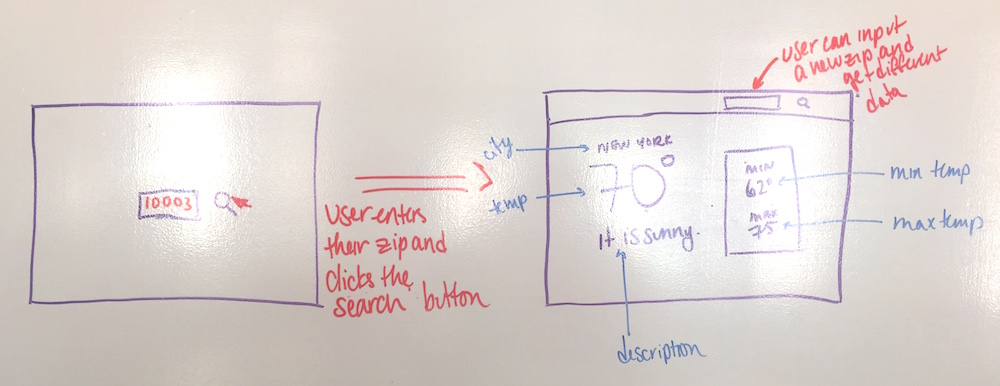

# Weather App

Building a small weather app using an API. User will get the local weather based by zipcode.

## Set Up

1. Signed up for a free [OpenWeatherMap](https://home.openweathermap.org/users/sign_up) account.
2. Received the [API key](https://home.openweathermap.org/api_keys)
3. Used Postman to check out the data you're working with and verify that your key works.:

## Mockup

Mockup of the Weather App

## The Content
- An input field for a user to enter a zip code.
- A `Submit` button.
    - When the `Submit` button is clicked:
        - A `GET` request should fetch the weather data from the API.
        - The following data should be rendered on the page:
            - City name
            - Current temperature
            - Weather description
            - Min temp
            - Max temp
- The temperature turn blue if below 40 and red if above 90.
